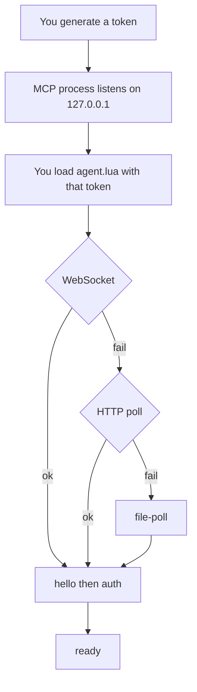
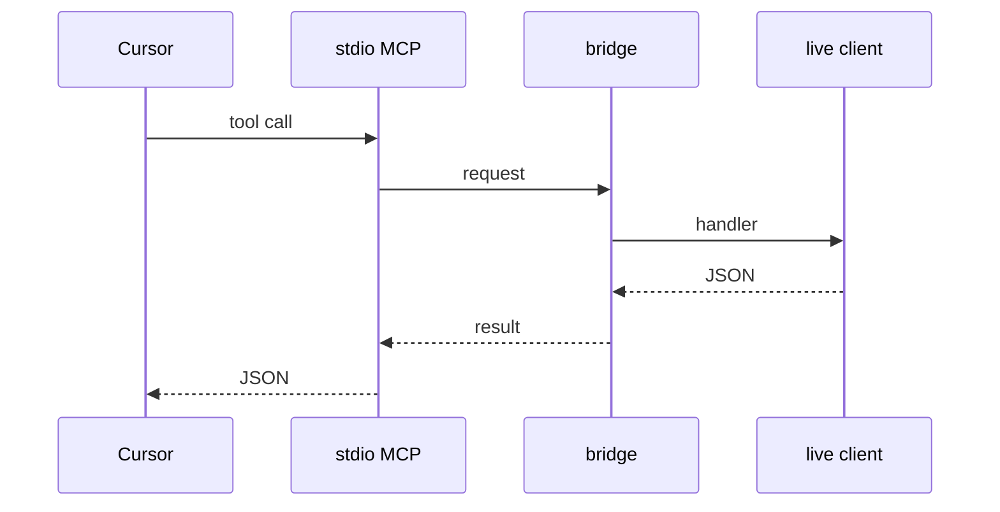
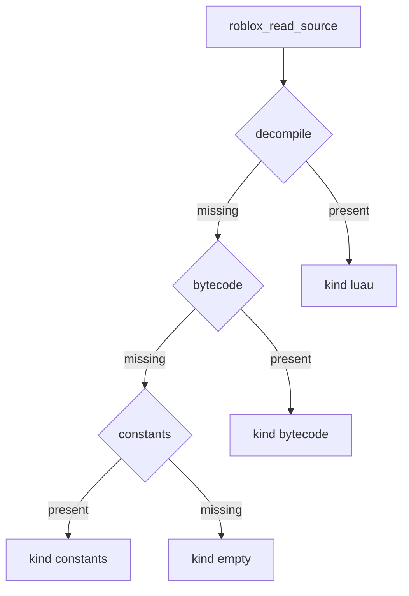

# roblox-client-mcp

`@3xjn/roblox-client-mcp` is a stdio MCP for a **live Roblox client**, not Studio. You inspect instances, scripts, and source, and you can eval.

You and the client share one token. The bridge binds `127.0.0.1` only. Use that, not `localhost`.

## Connect flow



## Tool-call flow



Any MCP client works the same way. Cursor is just the usual one.

## Source fallback



## Connect in three steps

**1. Generate a token** (at least 32 characters):

```powershell
[Convert]::ToHexString([Security.Cryptography.RandomNumberGenerator]::GetBytes(32)).ToLower()
```

**2. Start the MCP process** with that token:

```powershell
bun install
bun run src/index.ts
```

`bun start` is the same. Point Cursor (or any MCP client) at it over stdio:

```json
{
  "mcpServers": {
    "roblox-client-mcp": {
      "command": "bun",
      "args": ["run", "src/index.ts"],
      "cwd": "/path/to/roblox-client-mcp",
      "env": {
        "ROBLOX_CLIENT_MCP_TOKEN": "YOUR_TOKEN",
        "ROBLOX_CLIENT_MCP_PORT": "32145"
      }
    }
  }
}
```

`ROBLOX_CLIENT_MCP_PORT` defaults to `32145`.

**3. Load `agent.lua` in the live client** after setting the same token:

```lua
getgenv().RobloxClientMcp = {
    Token = "YOUR_TOKEN",
}

loadstring(readfile("agent.lua"), "roblox-client-mcp")()
```

Default URL is `ws://127.0.0.1:32145/live`. You need `loadstring` and `getgenv`. The agent tries WebSocket, then HTTP poll `http://127.0.0.1:32145/live/poll`, then file-poll `writefile`/`readfile` under `roblox-client-mcp/` in the executor workspace. If you land on file-poll, point `ROBLOX_CLIENT_MCP_FILEPOLL` at that directory on the host.

## Tools

Each tool returns JSON text. No authenticated client connected → the call fails.

| Tool | What it does |
| --- | --- |
| `roblox_list_instances` | List live instances. Optional `path` (default `game`), `scope` (`children` / `all` / `nil`), `query`, `className`, `limit`. |
| `roblox_list_scripts` | List scripts. Optional `query`, `scope` (`all` / `running` / `loaded` / `cached`), `limit`. |
| `roblox_read_source` | Read one script. Returns `{ kind, data }`. |
| `roblox_eval` | Run an explicit Luau chunk. Destructive. |

Source falls back decompile → bytecode → constants → empty. The agent capability-detects globals; it does not switch on executor names.

## Check

```powershell
bun run check
```
