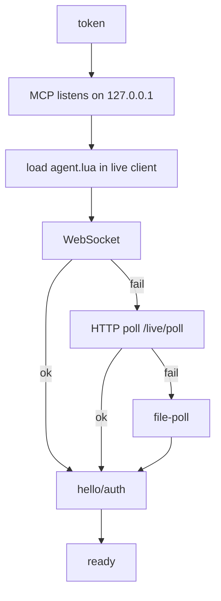
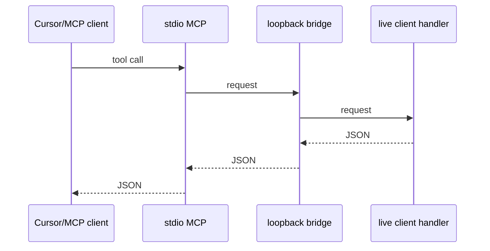
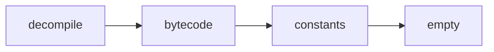

# roblox-client-mcp

stdio MCP for a live Roblox **client** (not Studio). Package
`@3xjn/roblox-client-mcp`.

You inspect a running client: instances, scripts, source, and eval. The
bridge is loopback only — bind and connect on `127.0.0.1`, not
`localhost`. Both sides share one token. The MCP owns that token: it
creates one on first start and reuses it.

## Connect

`bun install`, start the MCP, paste the Lua it prints.





### 1. Install and start

```
bun install
bun start
```

`bun start` is `bun run src/index.ts`. Cursor can spawn it. Example
`mcp.json` (Windows cwd):

```json
{
  "mcpServers": {
    "roblox-client-mcp": {
      "command": "bun",
      "args": ["run", "src/index.ts"],
      "cwd": "C:\\Users\\you\\roblox-client-mcp"
    }
  }
}
```

Don't also `bun start` by hand if Cursor is already spawning it, or the
port is taken.

On start, stderr prints the token, where it was stored, and the Lua to
paste. Stdout is MCP stdio — the token never goes there. Cursor shows
stderr in the MCP logs.

`ROBLOX_CLIENT_MCP_PORT` defaults to `32145`. Optional
`ROBLOX_CLIENT_MCP_FILEPOLL` is a host directory for the file-poll
fallback. `ROBLOX_CLIENT_MCP_TOKEN` overrides the stored token if you set
it.

### 2. Load the agent

Copy `agent.lua` into the executor workspace. Paste the printed Lua in
the live client. It looks like:

```lua
getgenv().RobloxClientMcp = {
    Token = "...",
}

loadstring(readfile("agent.lua"), "roblox-client-mcp")()
```

Default URL is `ws://127.0.0.1:32145/live`. The agent capability-detects
what the executor actually exposes. It requires `loadstring` and
`getgenv`. It does not switch on `identifyexecutor`.

It tries WebSocket first, then HTTP poll at `/live/poll`, then file-poll
with `writefile`/`readfile` under `roblox-client-mcp/` in the executor
workspace. If you land on file-poll, point `ROBLOX_CLIENT_MCP_FILEPOLL` at
that directory on the host.

## Tools

Each tool returns JSON text. Tools fail if no authenticated client is
connected.

| Tool | Returns |
| --- | --- |
| `roblox_list_instances` | An instance plus matches (`name`, `className`, `path`, `childCount`, `isScript`). Optional `path` (default `game`), `scope` (`children` / `all` / `nil`), `query`, `className`, and `limit`. |
| `roblox_list_scripts` | Matching scripts (`name`, `className`, `path`). Optional `query`, `scope` (`all` / `running` / `loaded` / `cached`), and `limit`. |
| `roblox_read_source` | `{ kind, data }`. Tries decompile, then bytecode, then constants, else empty (`luau` / `bytecode` / `constants` / `empty`). |
| `roblox_eval` | JSON-safe values from an explicit Luau chunk. Destructive. |



## Development

```
bun run check
```
